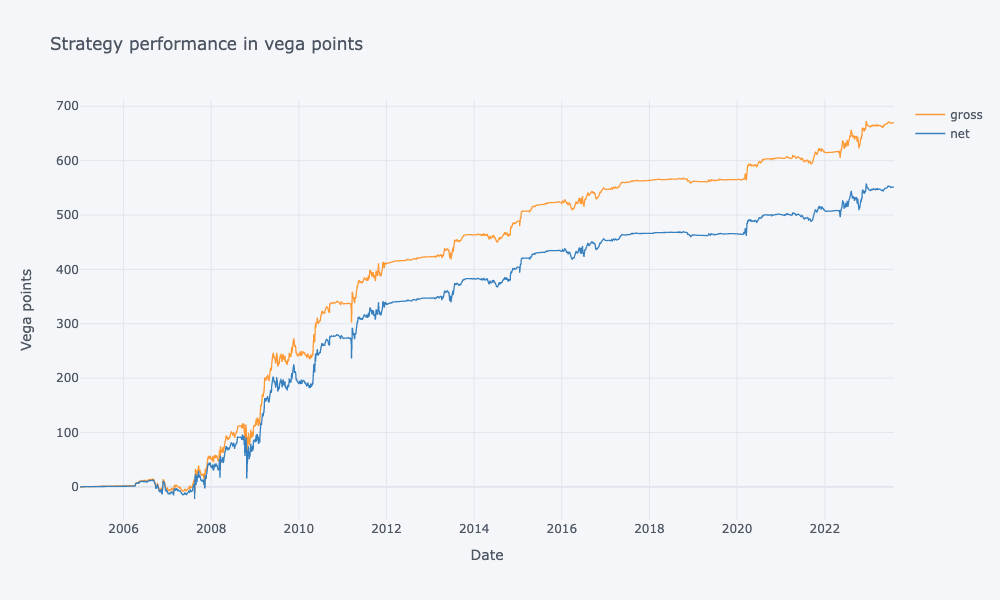

# FXVolStatArb
Construction of Relative Value strategies of OTC FX volatilities and backtest of the strategy.
[Link](https://rawcdn.githack.com/akaufman22/FXVolStatArb/50e1e1308a49f2c886e807b9aadc241570174d4f/Output.html) to the full report.
Notebook [here](./FXVolStatArb.ipynb).
Out-of-sample performance:
